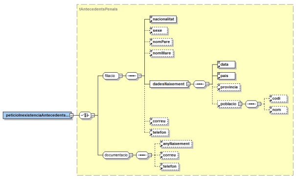
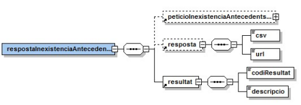
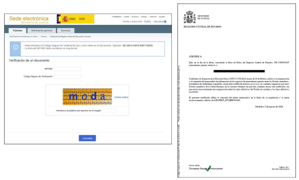

# VO-ANTECEDENTS_PENALS
Documentació d'integració del servei antecedents penals del Consorci AOC.

## Índex

1. [Introducció](#1)
2. [Transmissions de dades disponibles](#2)
3. [Missatgeria del servei](#3)
   1. [Consulta d’inexistència d’antecedents penals (ANTECEDENTS_PENALS)](#3.1)
      1. [Petició – dades genèriques](3.1.1)
      2. [Petició – dades específiques](#3.1.2)
      3. [Resposta – dades específiques](#3.1.3)
   2. [Consulta d’inexistència d’antecedents per delictes sexuals (DELICTES_SEXUALS)](#3.2)
      1. [Petició – dades genèriques](#3.2.1)
      2. [Petició – dades específiques](#3.2.2)
      3. [Resposta – dades específiques](#3.2.3)
   3. [Obtenció del certificat emès pel Ministeri de Justícia](#4)

## 1 Introducció <a name="1"></a>

Aquest document detalla la missatgeria associada als serveis de consulta d’inexistència
d’antecedents penals al Registre Central de Penats i d’inexistència d’antecedents per delictes sexuals
al Registre Central de Delinqüents Sexuals. Ambdós registres pertanyen al Ministeri de Justícia.

Per poder realitzar la integració cal conèixer prèviament la següent documentació:

```
 Document d’Especificació de missatgeria pel consum de productes de la plataforma PCI del
Consorci AOC.
```

## 2 Transmissions de dades disponibles <a name="2"></a>

Les dades disponibles a través dels serveis són les que es presenten a continuació:

- **EMISSOR**: Ministerio de Interior 

| **PRODUCTE** | **MODALITAT** | **DESCRIPCIO** |
| --- | --- | --- |
| **RCP** | ANTECEDENTS_PENALS | Consulta d’inexistència d’antecedents penals. 
| **RCP** | DELICTES_SEXUALS | Consulta d’inexistència d’antecedents per delictes sexuals. 

Les modalitats disposen de versió imprimible del resultat de la consulta en format PDF. Per més
detalls adreceu-vos a l’apartat Extensions de missatgeria del document de missatgeria genèrica.

## 3 Missatgeria dels serveis <a name="3"></a>

A continuació es detalla la missatgeria corresponent al bloc de dades específiques de les modalitats
de consum del producte.

```
L’emissor de les dades requereix que s’informin les dades del funcionari que realitza la consulta.
Així, cal informar els següents camps de l’element Funcionario del bloc de dades genèriques:
```
```
/Peticion/Funcionario/NombreCompletoFuncionario,
/Peticion/Funcionario/NifFuncionario,
//SolicitudTransmision/DatosGenericos/Solicitante/Funcionario/NombreCompletoFuncionario i
//SolicitudTransmision/DatosGenericos/Solicitante/Funcionario/NifFuncionario
```
### 3.1 Consulta d’inexistència d’antecedents penals <a name="3.1"></a>

```
El servei NO indica si un ciutadà té antecedents penals, indica si el ciutadà NO té antecedents penals. Si pel contrari, existeix una possibilitat que el ciutadà tingui antecedents per existir una possible coincidència al Registre d’Antecedents Penals, en aquest cas el ciutadà haurà de sol·licitar el certificat en l’oficina del Ministeri de Justícia corresponent.
```
```
En primera instància, l’emissor comprova el NIF, NIE o passaport, i en cas d’existència en el seu
entorn (Registre Central de Penats) proporciona la resposta corresponent sense validar la resta
de dades de la petició. En cas contrari -si no es troba l’identificador al seu entorn- realitza la
cerca per la resta de dades facilitades a la petició abans de donar la resposta final.
```
#### 3.1.1 Petició – dades genèriques <a name="3.1.1"></a>

3.1.1.1 Consulta per dades de filiació

| _Element_ | _Descripció_ |
| --- | --- |
//DatosGenericos/Titular/TipoDocumentacion | Tipus de documentació (NIF, NIE, Pasaporte).
//DatosGenericos/Titular/Documentacion | Documentació:<ul><li>NIF / DNI (8 dígits + caràcter de control).</li><li>NIE ([X,Y,Z] + 7 dígits + caràcter de control).</li><li>Passaport.</li></ul>
//DatosGenericos/Titular/Nombre | Nom del titular de la sol·licitud.
//DatosGenericos/Titular/Apellido1 | Primer cognom del titular de la sol·licitud.
//DatosGenericos/Titular/Apellido2 | Segon cognom del titular de la sol·licitud. Obligatori si la nacionalitat és espanyola.

3.1.1.2 Consulta per document d’identitat

| _Element_ | _Descripció_ |
| --- | --- |
//DatosGenericos/Titular/TipoDocumentacion | Tipus de documentació (NIF, NIE).
//DatosGenericos/Titular/Documentacion | Documentació:<ul><li>NIF / DNI (8 dígits + caràcter de control).</li><li>NIE ([X,Y,Z] + 7 dígits + caràcter decontrol).</li></ul>
//DatosGenericos/Titular/Apellido1 | Primer cognom del titular de la sol·licitud. Si no s’informa, cal indicar l’any de naixement a les dades específiques.

#### 3.1.2 Petició – dades específiques <a name="3.1.2"></a>

<p align="center">

</p>

### 3.1.2.1 Consulta per dades de filiació

| _Element_ | _Descripció_ |
| --- | --- |
/peticioInexistenciaAntecedentsPenals/nacionalitat | Nacionalitat del ciutadà de la consulta. La codificació correspon a la norma ISO3166-3 numèrica.
s/peticioInexistenciaAntecedentsPenals/sexe | Sexe del ciutadà:<ul><li>H (home)</li><li>D (dona)</li></ul>
/peticioInexistenciaAntecedentsPenals/nomPare | Nom del pare del ciutadà. Aquest bloc serà obligatori en cas de que el ciutadà sigui espanyol.
/peticioInexistenciaAntecedentsPenals/nomMare | Nom de la mare del ciutadà. Aquest bloc serà obligatori en cas de que el ciutadà sigui espanyol i si no s’inclou el nom del pare.
/peticioInexistenciaAntecedentsPenals/dadesNaixement | Bloc amb les dades de naixement del ciutadà de la consulta.
//dadesNaixement/data | Data de naixement del ciutadà de la consulta. No es permeten consultes d’anys anteriors al 1920 ni de menors d’edat. El format que ha d’informar-se es DD/MM/AAAA, tot i que el sistema admet els següents formats:<ul><li>00/MM/AAAA: casos en els que no es coneix el dia de naixement</li><li>00/00/AAAA: cas en el que no es coneix ni el dia ni el mes.</li><li>00/00/0000: cas en el que no es coneix ni el dia ni el mes ni l’any.</li></ul>
//dadesNaixement/pais | Codi del país de naixement del ciutadà de la consulta. La codificació correspon a la norma ISO3166-3 numèrica.
//dadesNaixement/provincia | Codi del ciutadà de la província de naixement del ciutadà. Aquest bloc serà obligatori en cas de que el ciutadà sigui espanyol. La codificació serà la utilitzada per l’INE.
//dadesNaixement/poblacio/codi | Codi de població de naixement del ciutadà. Aquest bloc serà obligatori per ciutadans nascuts a Espanya. La codificació serà la utilitzada per l’INE (5 dígits).
//dadesNaixement/poblacio/nom | Conté la descripció de la població de naixement. Aquest bloc serà obligatori per a ciutadans nascuts a l’estranger.
/peticioInexistenciaAntecedentsPenals/correu | Correu electrònic del titular consultat.
/peticioInexistenciaAntecedentsPenals/telefon | Telèfon del titular consultat. El format serà el següent: <ul><li>+00111111111</li><li>111111111</li></ul>

### 3.1.2.2 Consulta per document d’identitat

| _Element_ | _Descripció_ |
| --- | --- |
/peticioInexistenciaAntecedentsPenals/anyNaixement | Any de naixement si no s’informa el primer cognom en les dades genèriques.
/peticioInexistenciaAntecedentsPenals/correu | Correu electrònic del titular consultat.
/peticioInexistenciaAntecedentsPenals/telefon | Telèfon del titular consultat. El format serà el següent:<ul><li>+00111111111</li><li>111111111</li></ul>

#### 3.1.3 Resposta – dades específiques <a name="3.1.3"></a>

| _Element_ | _Descripció_ |
| --- | --- |
/respostaInexistenciaAntecedentsPenals/peticioInexistenciaAntecedentsPenals | Bloc de dades corresponent a la petició que origina la resposta.
/respostaInexistenciaAntecedentsPenals/resposta/csv | Codi segur de verificació identificador de la consulta.
/respostaInexistenciaAntecedentsPenals/resposta/url | URL de la seu electrònica del Ministerio de Justicia on es pot descarregar el certificat en PDF del Registro Central de Penados.
/respostaInexistenciaAntecedentsPenals/resultat/codiResultat | <ul><li>0 : No consten antecedents penals.</li><li>5 : No és possible resoldre la petició per aquesta via.</li><li>0231 : Document incorrecte.</li><li>0502 : Error genèric.</li></ul>
/respostaInexistenciaAntecedentsPenals/resultat/descripcio | Literal descriptiu del resultat de la consulta.

<p align="center">

</p>

### 3.2 Consulta d’inexistència d’antecedents per delictes sexuals <a name="3.2"></a>

```
El servei NO indica si un ciutadà té antecedents per delictes sexuals, indica si el ciutadà NO té
antecedents per delictes sexuals. Si pel contrari, existeix una possibilitat que el ciutadà tingui
antecedents per existir una possible coincidència al Registre Central de Delinqüents Sexuals, en
aquest cas el ciutadà haurà de sol·licitar el certificat a l’oficina del Ministeri de Justícia
corresponent.
```
```
En primera instància, l’emissor comprova el NIF, NIE o passaport, i en cas d’existència en el seu
entorn (Registre Central de Delinqüents Sexuals) proporciona la resposta corresponent sense
validar la resta de dades de la petició. En cas contrari -si no es troba l’identificador al seu entorn-
realitza la cerca per la resta de dades facilitades a la petició abans de donar la resposta final.
```
#### 3.2.1 Petició – dades genèriques <a name="3.2.1"></a>

```
Les dades genèriques de la petició són idèntiques a les de la modalitat de consulta d’antecedents
penals. Vegeu l’apartat 3.1.1 d’aquest document.
```

#### 3.2.2 Petició – dades específiques <a name="3.2.2"></a>

Les dades específiques de la petició són idèntiques a les de la modalitat de consulta d’antecedents
penals a excepció de l’element arrel (peticioInexistenciaAntecedentsPenalsDelictesSexuals).
Vegeu l’apartat 3.1.1.2 d’aquest document.

#### 3.2.3 Resposta – dades específiques <a name="3.2.3"></a>

Les dades específiques de la resposta són idèntiques a les de la modalitat de consulta d’antecedents
penals a excepció de l’element arrel (respostaInexistenciaAntecedentsPenalsDelictesSexuals).
Vegeu l’apartat 3.1.2.2 d’aquest document.

### 3.3 Obtenció del certificat emès pel Ministeri de Justícia <a name="3.3"></a>

El certificat en PDF emès pel Ministeri de Justícia –tant en la modalitat de consulta d’inexistència
d’antecedents penals al Registre Central de Penats com en la d’inexistència d’antecedents per
delictes sexuals al Registre Central de Delinqüents Sexuals– es pot obtenir accedint a la URL
indicada en la resposta a la consulta (seu electrònica del Ministeri) i allà, informant:

<ul><li>La documentació de l’individu consultat.</li><li>El CSV obtingut a la resposta.</li></ul>

<p align="center">

</p>
